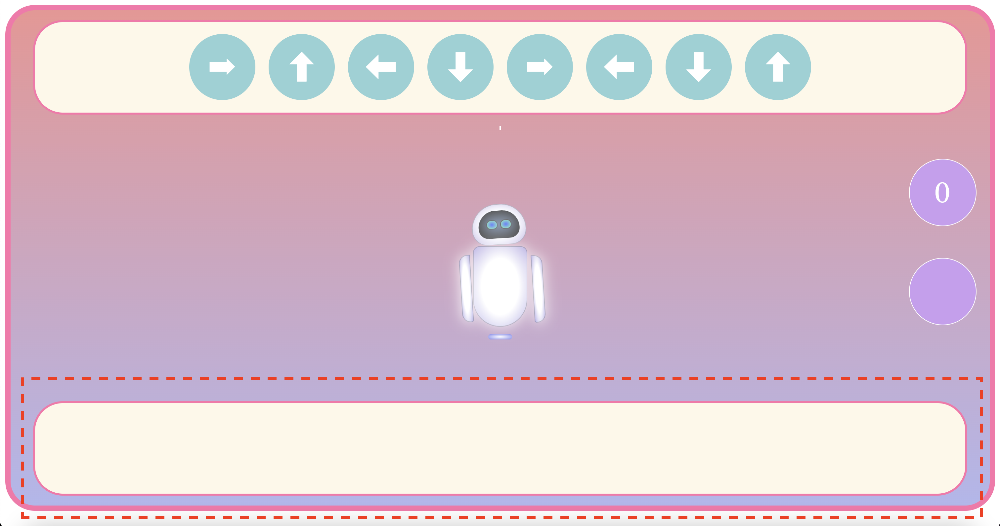

# Project 4 - Dance Robot Dance

https://newbz521.github.io/DDR/

Reaction speed based game. Test your skills here!

## Description

Game for testing your reaction / preciseness when it comes to keyboard commands. Try to match the computers output! You must match fully to recieve points!

### Playing Instructions

- The top bar will automatically generate shuffled directional keys.

  
  

- Use your "left", "right", "up", "down" arrows keys to match the random shuffled directions on the top output.
  
- Press your "spacebar" key after you match to your best of your abilities to check accuracy.
- Game will automatically run every 30 seconds.
- Your Highest score will be automatically recorded.

## Authors

Lawrence Yee, General Assembly SEI NYC 2022

## Disclaimer

Copyright Disclaimer under section 107 of the Copyright Act 1976, allowance is made for “fair use” for purposes such as criticism, comment, news reporting, teaching, scholarship, education and research.

Fair use is a use permitted by copyright statute that might otherwise be infringing.

## Issues

Game is not yet mobile deployable.
